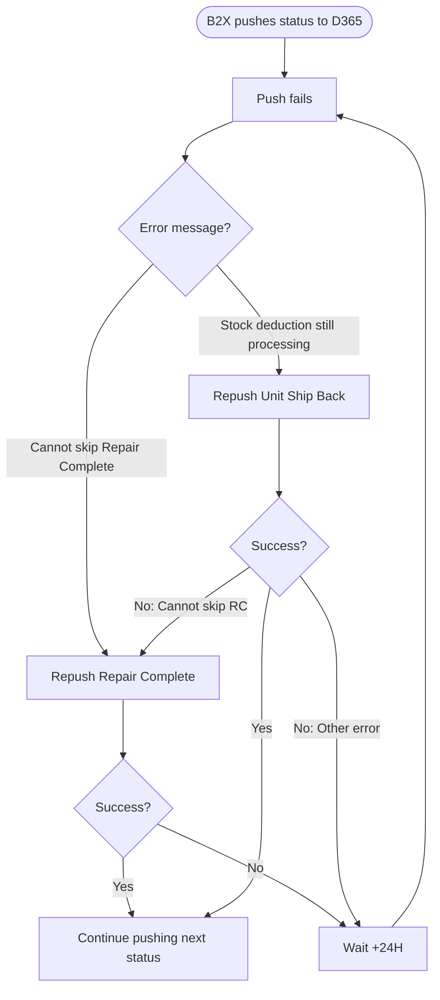
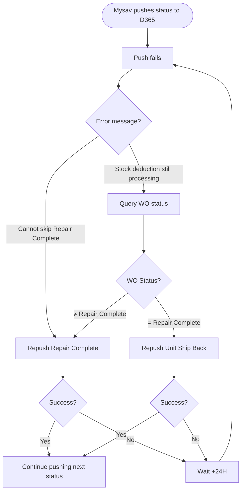

# B2X & Mysav 自动重推逻辑

> **文档目的**：记录 B2X 和 Mysav 工单状态推送失败后的自动重推策略，供双方 IT 团队参考实施。

**创建日期**：2026-09-16  
**相关系统**：D365 (CRM)、B2X、Mysav

---

## 背景

### 工单状态流转

```
Create → Under Repair → Repair Complete → Unit Ship Back
```

**关键约束**：
- **Repair Complete (RC) 是必传状态**，不可跳过
- 库存扣减在 RC 状态触发，**最多 1 分钟**完成
- 扣减状态：`stock deduction processing = Yes`（进行中）/ `No`（完成）

### 库存扣减失败场景

如果 RC 触发库存扣减失败：
- WO 状态停留在 **Under Repair**
- 工单打标 **out of stock**
- 需要人工调整库存后重推 RC

---

## 问题场景

### 场景 1：Cannot skip Repair Complete

**触发条件**：
- RC 库存扣减失败 → WO 停在 Under Repair
- 紧接着 Unit Ship Back (USB) 到达
- 系统报错：`Cannot skip Repair Complete status`

**影响**：USB 推送失败，需要重推 RC

### 场景 2：Stock deduction still processing

**触发条件**：
- RC 触发库存扣减（< 1min）
- 但 USB 在扣减完成前到达（B2X 推送间隔约 40s）
- 系统报错：`Stock deduction is still processing. Cannot update Work Order`

**影响**：USB 推送失败。24H 后扣减必然已完成，需根据最终结果重推

---

## 自动重推方案

### B2X 方案

**特点**：无 WO 状态查询接口，依赖错误信息路由

**频率**：+24H

**逻辑流程**：



**关键逻辑**：
1. 收到 `Cannot skip RC` → 重推 RC
   - 成功：继续推 USB
   - 失败（out of stock）：+24H 循环，直到人工调整库存
2. 收到 `Still processing` → 重推 USB
   - 成功：继续推下一状态
   - 失败（`Cannot skip RC`）：转 RC 路径
   - 失败（其他错误）：+24H 循环

**流程图**：[b2x-auto-repush.html](./b2x-auto-repush.html)

---

### Mysav 方案

**特点**：有 WO 状态查询接口，可精准路由

**频率**：+24H

**逻辑流程**：



**关键逻辑**：
1. 收到 `Cannot skip RC` → 重推 RC（同 B2X）
2. 收到 `Still processing` → **先查询 WO 状态**
   - WO = RC：扣减成功，直接重推 USB
   - WO ≠ RC：扣减失败（out of stock），重推 RC
   - 人工调整库存后，下次 RC 重推自动成功

**流程图**：[mysav-auto-repush.html](./mysav-auto-repush.html)

---

## 两套方案对比

| 维度 | B2X | Mysav |
|---|---|---|
| **状态查询接口** | ❌ 无 | ✅ 有 |
| **"Still processing" 处理** | 盲推 USB，靠错误信息路由 | 先查状态，精准路由 |
| **是否需要多一次推送** | ⚠️ 可能（USB → fail → RC） | ✅ 不需要（直达） |
| **效率** | 较低 | 较高 |
| **重复扣减风险** | 无（24H ≫ 1min） | 无（24H ≫ 1min） |

---

## 关键结论

### 共同点
- ✅ 库存扣减最多 1 分钟，24H 间隔充足
- ✅ 无重复扣减风险（24H ≫ 1min）
- ✅ Out of stock 时，RC 重推循环直到人工调整库存

### 差异点
- **B2X**：无查询接口，必须盲推 USB 后根据错误信息二次路由
- **Mysav**：有查询接口，可直接根据 WO 状态精准路由，避免无效推送

### 实施要点
- **"Start logic" 定义**：每 +24H，重新读取该 WO 最近一次推送失败的报错信息，按规则路由
- **Out of stock 处理**：RC 重推失败后继续循环，人工调整库存后自动恢复
- **最大重试次数**：建议设置告警阈值（如连续失败 7 天），避免无限循环

---

**文档维护**：如有逻辑变更，请同步更新本文档和对应的 HTML 流程图。
